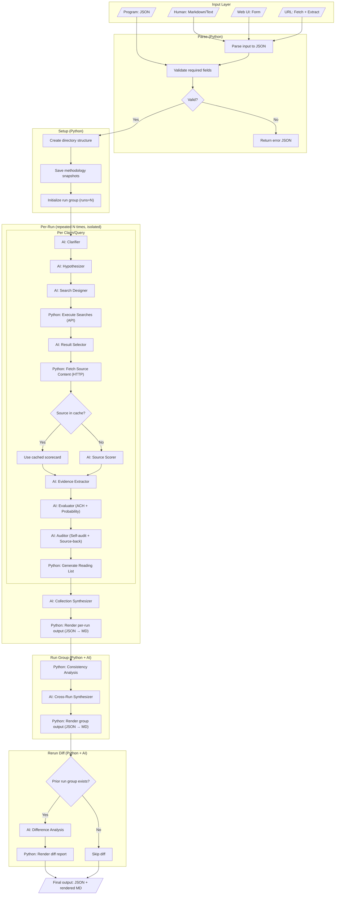

# Workflow Architecture

The research methodology as a deterministic Python-coordinated workflow
with AI sub-agents for analytical tasks.

## Workflow Chart



## Step Details

### Input Layer

| Source | Conversion | Cost |
|--------|-----------|------|
| Markdown/Text | AI parses to JSON (expensive) | ~5K tokens |
| JSON | Validate only (cheap) | ~0 tokens |
| Web UI | Frontend converts to JSON | ~0 tokens |
| URL | Python fetches, AI extracts claims | ~3K tokens |

The JSON path is the programmatic interface. Everything else converts
to JSON before entering the workflow.

### Python Steps (Deterministic)

| Step | Function | Input | Output |
|------|----------|-------|--------|
| Parse input | `parse_input()` | Raw text or JSON | Validated input JSON |
| Create dirs | `create_run_group()` | Config | Directory tree |
| Save snapshots | `save_snapshots()` | Prompt + format files | Copies |
| Execute searches | `execute_searches()` | Search plan JSON | Raw results JSON |
| Fetch sources | `fetch_sources()` | URL list | Page content |
| Check source cache | `check_cache()` | URL/DOI | Cached scorecard or None |
| Generate reading list | `generate_reading_list()` | Scorecards JSON | Sorted list |
| Render output | `render_output()` | Complete JSON | Markdown files |
| Consistency analysis | `analyze_consistency()` | N run JSONs | Metrics JSON |
| Render group output | `render_group_output()` | Synthesis JSON | Markdown files |
| Render diff | `render_diff()` | Diff JSON | Markdown file |

### AI Sub-Agents

| # | Name | Input JSON | Output JSON | Model | Cost est. |
|---|------|-----------|-------------|-------|-----------|
| 1 | Clarifier | `{claim, axioms}` | `{clarified, assumptions, scope, vocabulary}` | Opus | ~3K |
| 2 | Hypothesizer | `{clarified_claim}` | `{hypotheses: [{id, statement, predictions}]}` | Opus | ~2K |
| 3 | Search Designer | `{hypotheses, vocabulary}` | `{searches: [{query, target, rationale}]}` | Sonnet | ~2K |
| 4 | Result Selector | `{raw_results, hypotheses}` | `{selected: [...], rejected: [...]}` | Sonnet | ~3K |
| 5 | Source Scorer | `{page_content, rubric}` | `{scorecard: {reliability, relevance, bias_domains}}` | Sonnet | ~2K |
| 6 | Evidence Extractor | `{page_content, claim, hypotheses}` | `{extracts: [{text, hypothesis_relevance}]}` | Sonnet | ~3K |
| 7 | Evaluator | `{all_evidence, hypotheses, claim}` | `{ach_matrix, probability, reasoning_chain}` | Opus | ~5K |
| 8 | Auditor | `{assessment, sources, evidence}` | `{audit_domains: [...], source_back: [...]}` | Sonnet | ~3K |
| 9 | Collection Synthesizer | `{all_assessments}` | `{patterns, statistics, gaps, scorecard}` | Opus | ~4K |
| 10 | Cross-Run Synthesizer | `{consistency_data, run_results}` | `{aggregate_verdict, divergences}` | Opus | ~4K |
| 11 | Diff Analyzer | `{prior_group, current_group}` | `{per_entity_diff, collection_diff, article_impact}` | Sonnet | ~4K |

### Parallelism Boundaries

```
Sequential: Parse → Setup → [Parallel runs] → Group analysis → Diff

Per run group (parallel):
  run-1 ─┐
  run-2 ──┼── all run independently, then sync for group analysis
  run-3 ─┘

Per run (sequential per entity, parallel across entities possible):
  C001: Clarify → Hypothesize → Search → ... → Audit
  C002: Clarify → Hypothesize → Search → ... → Audit
  (could run in parallel if resources permit)

Per entity (sequential):
  Each step depends on the previous step's output.
  No parallelism within a single claim/query pipeline.

Per source (parallel within a step):
  Score SRC01 ─┐
  Score SRC02 ──┼── independent, can run in parallel
  Score SRC03 ─┘
```

### Estimated Token Usage Per Claim (Single Run)

| Component | Tokens |
|-----------|--------|
| Clarify + Hypothesize | ~5K |
| Search design | ~2K |
| Result selection (10 results) | ~3K |
| Source scoring (5 sources × 2K) | ~10K |
| Evidence extraction (5 sources × 3K) | ~15K |
| Evaluation + ACH | ~5K |
| Self-audit | ~3K |
| Collection synthesis | ~4K |
| **Total per claim (AI only)** | **~47K** |
| File rendering (Python) | **0** |

Compare to current all-AI approach: ~200K tokens per claim (includes
all file writing). **Estimated 75% reduction.**

For runs=3 with 5 claims: ~47K × 5 × 3 = ~705K tokens + synthesis.
Current approach: ~200K × 5 × 3 = ~3M tokens. **4x cheaper.**
