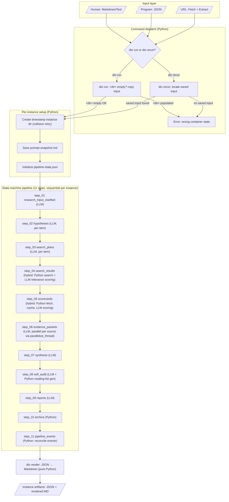

# Workflow Architecture

**Status:** Locked (baseline) — reflects the pipeline as implemented after
the merges of #110 (state-machine orchestration), #117 (naming rationalization),
#89/#124 (parallelization sprint), and #93 (run vs rerun, multi-run removed).
Future material changes to the pipeline structure require an update and
re-verification here before implementation.
**Last verified:** 2026-04-22 (post-merge verification against
`src/diogenes/state_machine.py` `PIPELINE_STEPS`, `src/diogenes/pipeline.py`,
`src/diogenes/commands/run.py`, `src/diogenes/renderer.py`).
**Sources:** Relocated from `docs/design/workflow-architecture.md`; content
was out-of-date pre-#93/#110 and has been rewritten here to match the merged
code. Referenced by the top-level
[`research-methodology.md`](research-methodology.md),
[`execution-model.md`](execution-model.md), and
[`state-machine.md`](state-machine.md). Sub-agent invocation patterns
and tooling integration remain in `docs/design/`
(`sub-agent-preamble.md`, `tooling-integration.md`).

## Purpose

The research methodology as a deterministic Python-coordinated workflow
with AI sub-agents for analytical tasks.

## Invocation model

Two commands drive the pipeline — both produce a single **instance** of the
11-step pipeline inside a **research container** on disk:

- `dio run <input> --output <dir>` — first-time research. `<dir>` must be
  empty or nonexistent. Copies the source input into `<dir>` (immutable
  from that point) and creates the first timestamped instance
  subdirectory, then runs the pipeline inside it.
- `dio rerun --output <dir>` — subsequent research. `<dir>` must contain
  the saved source input from a prior `dio run`. Creates a new
  timestamped instance and runs the pipeline against the saved input
  (re-clarifying from scratch, so the per-instance record reflects
  model/tool evolution).

```text
<output>/                         research container (parent)
  <input-file>                    immutable source input (copied by `dio run`)
  2026-04-22-131000/              instance 1
    research-input-clarified.json step_01 output
    hypotheses.json               step_02 output
    search-plans.json             step_03 output
    search-results.json           step_04 output
    source-scorecards.json        step_05 output
    evidence-packets.json         step_06 output
    synthesis.json                step_07 output
    self-audit.json               step_08 output
    report.json                   step_09 output
    pipeline-state.json           per-step state + timings
    prompt-snapshot.md            methodology snapshot
    usage.json                    per-step token + model + cost
  2026-07-15-094500/              instance 2 (from `dio rerun`)
    research-input-clarified.json re-clarified; models may have evolved
    ...
```

The `--runs` flag and N-run-group concept have been removed (#93). A
"research group" is now the set of sibling timestamped instance
directories under a single research-container parent, and time-series
comparison across instances is a consumer concern, not a pipeline
output. No cross-instance synthesis, consistency, or diff artifact is
produced by the pipeline.

## Workflow chart



### Per-step fetch caching

`step_05` (source scoring) consults a content cache keyed by URL/DOI
before fetching. Cache hits are annotated in the per-source scorecard so
readers can distinguish freshly-scored from replayed sources (see
[`output-contract.md`](output-contract.md) R19). The cache is a
pipeline-level concern inside `step_05`, not a separate step.

### Per-source parallelism inside steps

- `step_05` scoring: currently serial (tech-debt
  [`../tech-debt-register.md`](../tech-debt-register.md) TD-004).
- `step_05` fetch: parallel via `parallelize_process`
  (thread-unsafety of `lxml`/`trafilatura`; see TD-002).
- `step_06` evidence extraction: parallel via `parallelize_thread`
  (#89 — was the slowest step at 711.6s; now parallel).

## Step catalogue

The canonical step sequence lives in `src/diogenes/state_machine.py` as
`PIPELINE_STEPS: list[StepDefinition]`. Both the CLI path (`dio run` /
`dio rerun`) and the `/research` skill path iterate the same sequence.
Each step has a category (`llm`, `python_only`, or `hybrid`), an output
file, an optional JSON schema for the output, an optional prompt file,
an optional Python handler, post-validators, and optional MCP tools. See
[`state-machine.md`](state-machine.md) for the per-node contract.

| # | Step name | Category | Output file | Notes |
|---|-----------|----------|-------------|-------|
| 1 | `step_01_research_input_clarified` | llm | `research-input-clarified.json` | Clarifies the input; per-instance so re-clarification on `dio rerun` captures model drift |
| 2 | `step_02_hypotheses` | llm | `hypotheses.json` | Minimum-3-hypothesis rule enforced in Python |
| 3 | `step_03_search_plans` | llm | `search-plans.json` | Produces concrete, searchable queries with targets |
| 4 | `step_04_search_results` | hybrid | `search-results.json` | Python executes searches via `dio_search` / `dio_search_batch`; LLM scores relevance in batches of `_RELEVANCE_BATCH_SIZE = 5`; Python sorts/filters at `_RELEVANCE_THRESHOLD = 5` |
| 5 | `step_05_scorecards` | hybrid | `source-scorecards.json` | Python fetches (parallel `parallelize_process`); LLM scores with `content_extract`/`content_summary`/`authors`/`date`/`items`; `_MAX_SOURCES_TO_SCORE = 15`, `_SCORING_BATCH_SIZE = 1` (TD-004) |
| 6 | `step_06_evidence_packets` | llm | `evidence-packets.json` | Parallel via `parallelize_thread`; produces verbatim excerpts tied to hypotheses; Python verifies verbatim via `_verify_packet_verbatim` |
| 7 | `step_07_synthesis` | llm | `synthesis.json` | Synthesis + ACH + probability assessment |
| 8 | `step_08_self_audit` | llm | `self-audit.json` | ROBIS audit + source-back verification; Python generates reading list |
| 9 | `step_09_reports` | llm | `report.json` | Assembles final report |
| 10 | `step_10_archive` | python_only | — | Archives artifacts |
| 11 | `step_11_pipeline_events` | python_only | — | Reconciles pipeline events; writes `pipeline-state.json` summary |

## Input layer

| Source | Conversion | Notes |
|--------|-----------|-------|
| JSON | validated against `research-input.schema.json` | programmatic interface |
| Markdown/Text | routed to `step_01`; clarifier parses via standard preamble | AI conversion happens inside step_01 |
| URL | Python fetches, claims extracted during `step_01` | URL acquisition is mechanical |

The JSON path is the canonical interface; every other surface converts
to JSON before entering the state machine.

## Parallelism boundaries

Parallelism is specified in detail in [`parallelization.md`](parallelization.md).
In summary:

```
Sequential per instance:
  step_01 → step_02 → step_03 → … → step_11
  (enforced by state_machine.py requires-list on each StepDefinition)

Per-item (claim/query/statement) inside a step: sequential loop.

Per-source parallelism inside a step:
  step_05 fetch:     parallelize_process  (lxml/trafilatura thread-unsafety, TD-002)
  step_05 scoring:   serial               (TD-004 — scorer parallelization open)
  step_06 extract:   parallelize_thread   (shipped in #89)

Across instances: sequential by convention; `dio rerun` creates a new
instance on demand. No pipeline-level cross-instance coordination.
```

## Methodology snapshot

Each instance persists a `prompt-snapshot.md` capturing the prompts in
force at run time and a `pipeline-state.json` capturing per-step
status, timings, and retries. A `usage.json` captures per-step token
and model information, supporting the cost-accounting requirement in
[`output-contract.md`](output-contract.md) R17 / R18.

## Cost reference (observed baseline)

The following are observed figures from a full 11-step run and are
informational, not normative:

- Full 11-step run: **~$1.93** per run with prompt caching (Sonnet
  judgement steps, ~2 claims + 1 query).
- Slowest single step (before #89): `step_06` evidence extraction at
  ~711.6s wall-clock; now parallelized across sources.
- Rejected alternative: Anthropic web search tool at **~1.5M tokens /
  ~$10+** per run — rationale captured in
  [`execution-model.md`](execution-model.md) and
  `project_search_architecture_decision`.

Per-step token, model, and cost details for any given run are
recoverable from the instance's `usage.json`.
